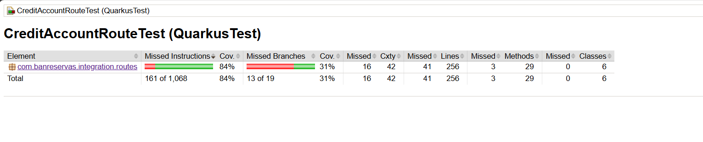

# ms-orq-credito-cuenta

Servicio que realiza un crédito a una cuenta de ahorros o cuenta corriente en Fiserv. .

# Variables del ambiente

```
consulta.tipo.producto.url = https://ms-cons-tipo-prod-dev.apps.az-aro-dev.banreservas.com/api/v1/consulta-tipo-producto
obtener.lista.valores.url = https://ms-obt-lis-val-dev.apps.az-aro-dev.banreservas.com/api/v1/obtener-lista-valores
consulta.general.producto.url = https://ms-cons-gral-prod-dev.apps.az-aro-dev.banreservas.com/api/v1/consulta-general-producto
transferencia.efectivo.com.url = https://ms-transf-efect-com-dev.apps.az-aro-dev.banreservas.com/api/v1/transferencia-efectivo
reverso.transferencia.efectivo.com.url = https://ms-rev-transf-efect-com-dev.apps.az-aro-dev.banreservas.com/api/v1/ms-reverso-transferencia-efectivo

originAccount.account=1770110435
originAccount.productLine=GL    
cost.center =45240
cuenta.ahorro = AH26
cuenta.corriente = CC20
monto.minimo.dop = 1
monto.maximo.dop =400000
monto.minimo.usd =0
monto.maximo.usd =100000

ValidacionCuentaInclusivaDebito = VAL01 - ESTE PRODUCTO NO SOPORTA ESTE TIPO DE TRANSACCION
MonedaCreditoCuenta = 480 - LAS MONEDAS DE LAS CUENTAS DEBEN SER IGUALES.
RangoCreditoTPD = TPD03 - EL DEPOSITO A INTENTAR ESTA FUERA DEL RANGO.
ImporteNegativo = S034 - IMPORTE DE TRANSACCION NO PUEDE SER NEGATIVO.
MensajeCuentaNoActiva = S033 - CUENTA NO ESTA EN ESTADO ACTIVA.
MonedasIguales = LA MONEDA DEL IMPORTE NO ES  VÁLIDA.
TerminalInvalida = TPD04 - TERMINAL Y EMPRESA NO CONCUERDAN.
ValidarRangoMonto = true
```
### Tecnologías

- **OpenJDK 21**: Plataforma de desarrollo para la creación de aplicaciones en Java.
- **Quarkus 3.8.0.Final**: Framework Java nativo para la nube, optimizado para contenedores.
- **Maven 3.9.8**: Herramienta de gestión y construcción de proyectos, usada para la gestión de dependencias.
- **JaCoCo**: Herramienta para medir la cobertura del código en las pruebas.

## Requisitos para el Despliegue en Entorno de Desarrollo

Para desplegar la aplicación en un entorno de desarrollo, asegúrate de cumplir con los siguientes requisitos tecnológicos:

### Tecnologías Necesarias

- **Docker**: Docker es requerido para crear y gestionar contenedores.
    - **Versión recomendada**: Docker Desktop última versión.
    - **Nota**: Docker debe estar instalado y en ejecución en tu sistema antes de iniciar el despliegue.

- **Quarkus Dev Services**: El proyecto utiliza Quarkus Dev Services para la creación automática de servicios dependientes en contenedores Docker.
    - **Nota**: Quarkus Dev Services se activa automáticamente al ejecutar la aplicación en modo dev.

### Comandos de Ejecución

> Maven: `mvn clean install -U quarkus:dev`
> Sin maven: `./mvnw compile quarkus:dev`

### Instrucciones de Configuración para Windows
- **OpenJDK 21**: Se debe tener instalado OpenJDK 21 en el sistema.
    - **Descarga**: [OpenJDK 21](https://jdk.java.net/archive/).
    - **Instalación**: Sigue las instrucciones de instalación de OpenJDK 21 en tu sistema.

## Autenticación

Para obtener el token de autenticación necesario, se puede utilizar Keycloak u otro proveedor de identidad configurado en el sistema.

## Endpoints

Endpoint para credito a cuentas:

> Método: POST

> URL:
```
http://localhost:8080/credit/account/api/v1/CreditAccount
```
> Request:
```JSON
{
  "consumerId": "CashMD",
  "user": "CashMD",
  "terminal": "C14-053",
  "dateTime": "2024-06-18 16:41:57",
  "version": 1,
  "product": {
    "number": "3110002733",
    "productLine": "CuentaAhorro",
    "currency": "DOP"
  },
  "amount": {
    "currency": "DOP",
    "amount": 100
  },
  "description": "2143"
}
```

>Response (éxito):
```JSON
{
  "header": {
    "responseCode": "200",
    "responseMessage": "Exitoso"
  },
  "body": {
    "creditAccountResult": {
      "channel": "CashMD",
      "user": "CashMD",
      "terminal": "C14-053",
      "dateTime": "2024-06-18 16:41:57",
      "transactionId": "6110503779",
      "type": 0,
      "message": "TRANSACCION PROCESADA",
      "version": "1"
    }
  }
}
```


>Response (error):
```json
{
  "header": {
    "responseCode": "400",
    "responseMessage": "Solicitud Incorrecta"
  },
  "body": {
    "creditAccountResult": {
      "channel": "",
      "user": "",
      "terminal": "",
      "dateTime": "",
      "transactionId": "",
      "type": 1,
      "message": "Error al consultar TransferenciaEfectivoCom: Currency code error",
      "version": ""
    }
  }
}
```

Cobertura de los test unitarios



Endpoint Health Check:

> URL Liveness
```
http://localhost:8080/api/q/health/live
```

> URL Readiness
```
http://localhost:8080/api/q/health/ready
```

Endpoint Documentación:

> URL OpenAPI
```
http://localhost:8080/api/q/openapi?format=json
```

## Encabezados Requeridos 

Los siguientes encabezados son obligatorios para todas las solicitudes:

```
Authorization: Bearer token JWT para autenticación
```

## Ejecutar la aplicación en modo dev

Para ejecutar la aplicación en modo dev con live coding use el siguiente comando:
```shell script
./mvnw compile quarkus:dev
```

> **_NOTA:_** Quarkus proporciona una UI de desarrollo, disponible solo en modo dev en http://localhost:8080/q/dev/.

## Empaquetando y corriendo la aplicación

La aplicación puede ser empaquetada usando el siguiente comando:
```shell script
./mvnw package
```
Este comando produce el archivo `quarkus-run.jar` en el directorio `target/quarkus-app/`.
Tenga cuidado este no es _über-jar_; las dependencias son copiadas al directorio `target/quarkus-app/lib/`.

La aplicación la puede ejecutar con el comando `java -jar target/quarkus-app/quarkus-run.jar`.

Si se quiere un _über-jar_, ejecute el siguiente comando:
```shell script
./mvnw package -Dquarkus.package.type=uber-jar
```

La aplicación, empaquetada como un _über-jar_, se puede ejecutar con el comando `java -jar target/*-runner.jar`.

## Pruebas y Cobertura de Código

El proyecto utiliza JaCoCo para medir la cobertura del código en las pruebas. Para ejecutar las pruebas con cobertura:

```shell script
./mvnw clean verify
```

El informe de cobertura estará disponible en `target/site/jacoco/index.html`.

## Creando un ejecutable nativo

Se puede crear un ejecutable nativo con el siguiente comando:
```shell script
./mvnw package -Dnative
```

O, si no tiene GraalVM instalado, se puede ejecutar el siguiente comando para construir el ejecutable nativo:
```shell script
./mvnw install -Dnative -Dquarkus.native.container-build=true -Dquarkus.native.container-runtime=podman
```

Se puede ejecutar el nativo de la siguiente manera: `./target/ms-valida-proveedor-ars-1.0.0-runner`

## Guías relacionadas

- RESTEasy Reactive ([guide](https://quarkus.io/guides/resteasy-reactive)): Implementación de Jakarta REST utilizando procesamiento en tiempo de compilación y Vert.x.
- SmallRye Mutiny ([guide](https://quarkus.io/guides/mutiny-primer)): Una biblioteca para programación reactiva en Java.
- SmallRye Health ([guide](https://quarkus.io/guides/smallrye-health)): Monitoreo de la salud del servicio.
- SmallRye OpenAPI ([guide](https://quarkus.io/guides/openapi-swaggerui)): Documentación de APIs REST con OpenAPI y Swagger UI.
- Jacoco - Code Coverage ([guide](https://quarkus.io/guides/tests-with-coverage)): Soporte para cobertura de código con Jacoco.
- Microprofile Fault Tolerance ([guide](https://quarkus.io/guides/microprofile-fault-tolerance)): Estrategias de tolerancia a fallos como timeouts, reintentos y circuit breakers.
- Microprofile JWT ([guide](https://quarkus.io/guides/security-jwt)): Autenticación y autorización basada en JWT.

## Autor

* **Gerald Antonio Silverio Serrata** - *Developer - C-GASilverio@banreservas.com*